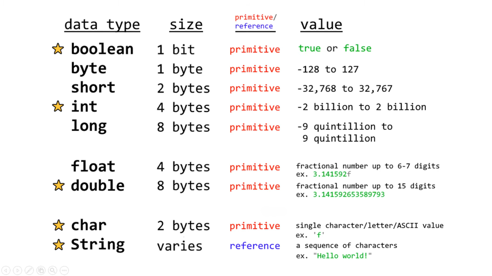

<h2>This is my personal project of learning JAVA</h2>

<details>
<summary>Starting code of a java file</summary>
  
```
public class *filename*{
  public static void main(String[] args){
  }
}
```
</details>
<br>
<h3>Things learned:</h3>

<details><summary>1. show something</summary>
  
  ```
  System.out.println("");
  System.out.println(x);
  System.out.print(x);
  ```
</details>
<details><summary>2. few escape sequences(\):</summary>
  
```
  \n for new line
  \t for tab/spaces
  \" for quotes
  \\ for backslash
```
</details>

<details><summary>3. comment</summary>
  
```
//this is a comment
/*this is multiple lines of comment
 *this is multiple lines of comment
 */
```
</details>

<details><summary>4. variables:</summary>
  
</details>

<details><summary>5. swap 2 variables</summary>
introduce a temp variable and store one of the variables
  
```
  temp = x;
  x = y;
  y = temp;
```
</details>

<details><summary>6. user input/scanner</summary>
  
```
import java.util.Scanner;
public class Main {
  public static void main(String[] args) {
    Scanner scanner = new Scanner(System.in);
  
    System.out.println("What is your name? ");
    String name = scanner.nextLine();
  
    System.out.println("How old are you? ");
    int age = scanner.nextInt();
    scanner.nextLine(); //to keep the scanner running
  
    System.out.println("What is your favorite food?");
    String food = scanner.nextLine();
   
    System.out.println("Hello "+name);
    System.out.println("You are "+age+" years old");
    System.out.println("You like "+food);
  } 
}
```
</details>

